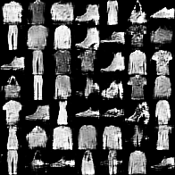

DCGAN For Using-Fashion-Mnist

---

**  DCGAN Source code from https://github.com/vwrs/dcgan-mnist

---

**  Fashion-Mnist from https://github.com/zalandoresearch/fashion-mnist

---
**  Environment: Windows 10 x64,keras 2,python 3.6,Anaconda 4.4

---
**  result(epoch 7):

